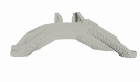
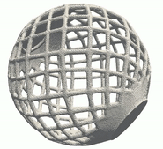

.. summary-start

TopOpt_in_PETSc_wrapped_in_Python
===============

``TopOpt_in_PETSc_wrapped_in_Python`` provides a Python wrapper called ``topoptlib`` and extends the functionality of the TopOpt_in_PETSc framework [1]_ [2]_ [3]_.

The Python interface simplifies the problem definition, is expanding the potential user-base and facilitates the use of a large-scale topology optimization framework for educational purposes. Furthermore, the functionality of the topology optimization framework is extended which contributes to its usability to real-world design applications. The functionality is demonstrated via the cantilever beam, bracket- and torsion ball examples. Several tests are provided which can be used to verify the proper working and compare the performance of the user’s system setup.

.. summary-end

.. not-in-documentation-start

Implemented functionality
--------

Large scale, high-resolution topology optimization including:

- STL (file format for storing surface geometry) input files to define the design domain, solid-, void- and rigid regions and voxelization
- Exclusion of passive elements from the simulation
- Application of loads and constraints using parametrization functions
- Multi-load cases and multi-constraints
- User defined objective- and constraint functions
- Local-volume constraint for 3D printing infill and bone like structures
- Continuation strategy for the penalization value
- Test scripts for code verification

Running examples
--------

To run the cantilever beam example on one CPU (adjust the problem's mesh according to the number of available CPU's):

.. code:: bash

    cd TopOpt_in_PETSc_wrapped_in_Python
    cp examples/beam.py .
    python3 beam.py

Available examples:

- Cantilever beam in ``beam.py``
- Multi-loads in ``multiloads.py``
- Torsion ball in ``sphere.py``
- The Jet engine bracket in ``bracket.py``

Installation
------------

The framework should be compiled ones, on a cluster or a desktop computer. A problem file can use the functionality of the framework without compiling thereafter. A Linux system is recommended, however not tested, a Windows machine should also work.
The framework uses [CMake](https://cmake.org) to compile. The following third party libraries are required and located using CMake's ``find_package``.

- [PETSc](https://www.mcs.anl.gov/petsc/): version 3.13
- [Python] (https://www.python.org/): version 3

It install PETSc:

.. code:: bash

    git clone -b release https://gitlab.com/petsc/petsc.git petsc
    cd petsc
    ./configure --with-cc=mpicc --with-cxx=mpicxx --with-fc=0 --download-f2cblaslapack=1 --with-debugging=0
    make PETSC_DIR=/home/ts/Documents/petsc PETSC_ARCH=arch-linux-c-opt all
    make PETSC_DIR=/home/ts/Documents/petsc PETSC_ARCH=arch-linux-c-opt check

To download this framework:

.. code:: bash

    git clone https://github.com/thsmit/TopOpt_in_PETSc_wrapped_in_Python.git

To compile the framework (paths will differ):

.. code:: bash

    export PETSC_ARCH=arch-linux-c-opt
    export PETSC_DIR=/home/ts/Documents/petsc
    cd TopOpt_in_PETSc_wrapped_in_Python
    mkdir build
    cd build
    cmake .. -D PETSC_EXECUTABLE_RUNS=ON
    make

Running on ETH Euler
--------

.. code:: bash

    env2lmod
    module load gcc/4.8.5 cmake/3.16.5 openmpi/3.0.1 petsc/3.10.5 python/3.7.4
    cd TopOpt_in_PETSc_wrapped_in_Python
    mkdir build
    cd build
    cmake ..
    make
    cd ..
    bsub -n 8 mpirun -n 8 python bracket.py

Or use ``run_topopt.sh`` for automated building and running

Tests
------------

Several tests are provided to verify the proper working of the framework. To run a test using 4 CPU's use:

.. code:: bash

    cd TopOpt_in_PETSc_wrapped_in_Python
    cp topoptlib/test/test_beam.py .
    mpirun -n 4 python3 test_beam.py

Implemented tests in ``/tests``:

- Testing standard MBB problem with maxItr of 40 ``test_beam.py``
- Testing the standard MBB problem with two line loads ``test_multiload.py``
- Testing continuation of penalization ``test_continuation.py``
- Testing heavyside projection filtering ``test_projection.py``
- Testing stl readin of design domain, rigid domain ``test_sphere.py``

Or use ``test_topopt.sh`` for automated building and running the tests

Post-processing
--------

After solving the problem the output is written to a ``output.dat`` file. The designs can be viewed in Paraview (https://www.paraview.org/).
To generate .vtu files from the output file use ``post_process_topopt.sh`` with Python 2 (with * the file path and name where the output file is stored):

.. code:: bash

    cd TopOpt_in_PETSc_wrapped_in_Python
    ./post_process_topopt.sh *

Citing
--------

For citing this work use:

.. code:: bib

    @article{Smit2021,
    author =       "..",
    title =        "{..},
    journal =      "..",
    volume =       "..",
    number =       "..",
    pages =        "..",
    year =         "..",
    DOI =          ".."
    }

Original code
--------

.. [1]

    Aage, N., Andreassen, E., & Lazarov, B. S. (2015). Topology optimization using PETSc: An easy-to-use, fully parallel, open source topology optimization framework.
    Structural and Multidisciplinary Optimization, 51(3), 565–572. https://doi.org/10.1007/s00158-014-1157-0

.. [2]

    http://topopt.dtu.dk/PETSc

.. [3]

    https://github.com/topopt/TopOpt_in_PETSc
